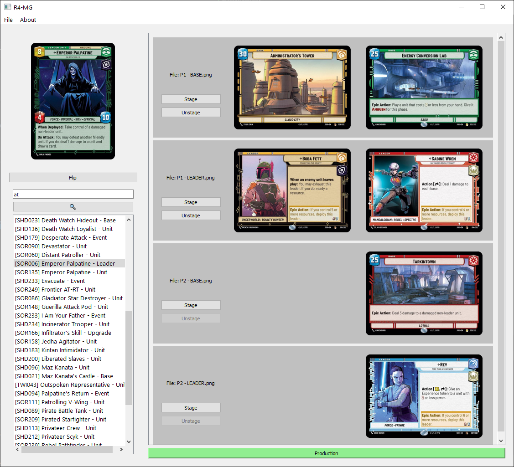
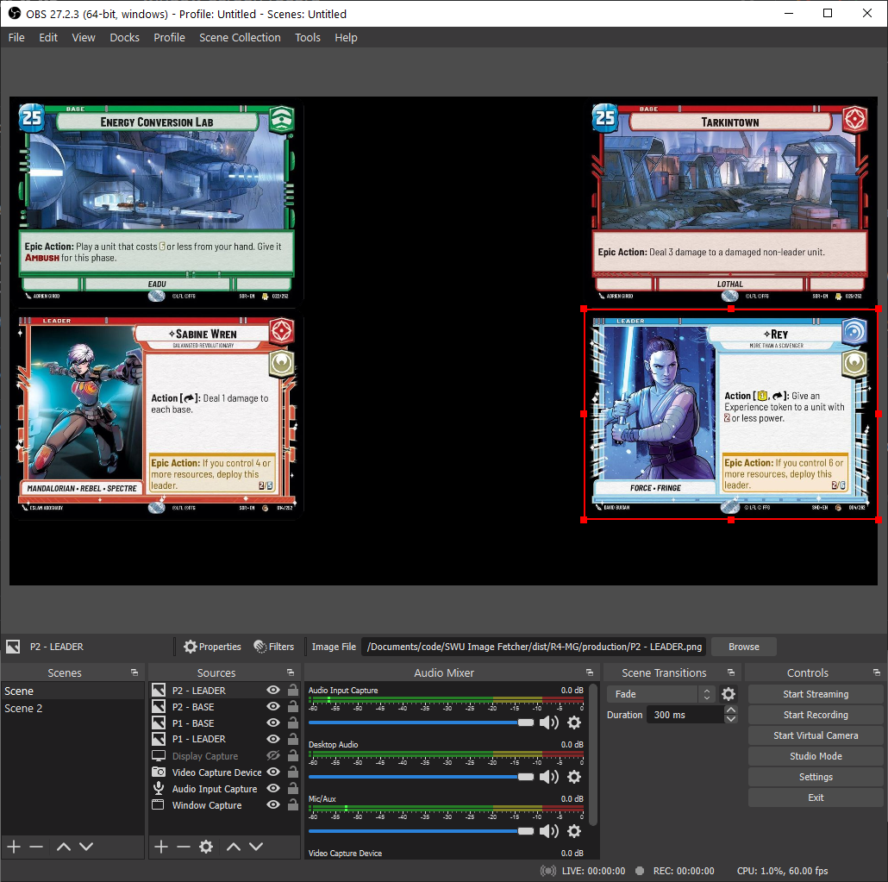

# R4-MG
Courier droid for delivering SWU cards to streams.

## Installation
1. Download the [latest release build](https://github.com/hdchan/R4-MG/releases)
2. Extract `R4-MG`.
3. Open `R4-MG.exe`

## How to use

### Folders
Two folders will get generated during usage of R4-MG (R4):
- cache - this stores all the cards you've previewed from your search.
- production - this stores the cards that you intend to use to show on your stream. OBS should make use of the files that are stored here.

### Dashboard

We can search for cards on the left side, and stage them to their respective files. Once ready, pressing on "Production" will copy the staged cards over to the `./production` folder.

The list on the right hand side is populated with any `.png` files that are stored in the production folder. You can either drag your own `.png` file in to load it into R4, or add generate a new one to use in the `File` menu.

### Usage with OBS

We can source image files on our stream from the `./production` folder, and they'll be updated simultaneously when sending staged cards to the `./production` folder.

## Changelog

### 0.2.0

#### Feature updates
- Reprograms designation to: `R4-MG`.
- Adds performance mode 🚗💨.
- Adds keyboard shortcuts for:
  -  Focus search bar: `Ctrl+L`
  -  Submit search: `Enter`
  -  Navigate search list: `Key down`, `Key up`
  -  Flip selected card: `Ctrl+F`
  -  Stage selected card: `Ctrl+NUM`
  -  Push staged cards to production: `Ctrl+P`
- Updates UI layouts and improves responsiveness.
- Improves UX.

#### Engineering updates
- Refactors project to split core functionality from UI functionality.
- Implements async call for:
  - Search
  - Image download and processing
- Adds observer/subscriber.
- Adds configuration.

### 0.1.0
- MVP